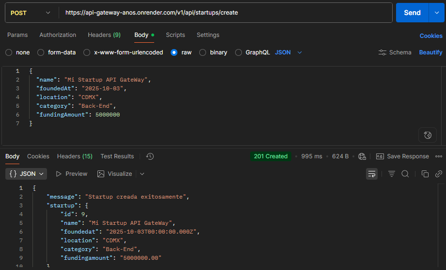
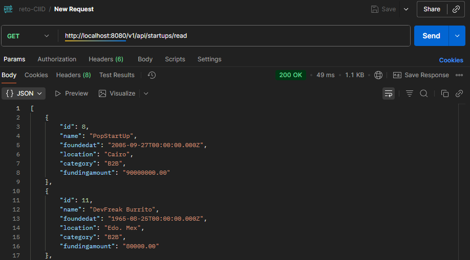
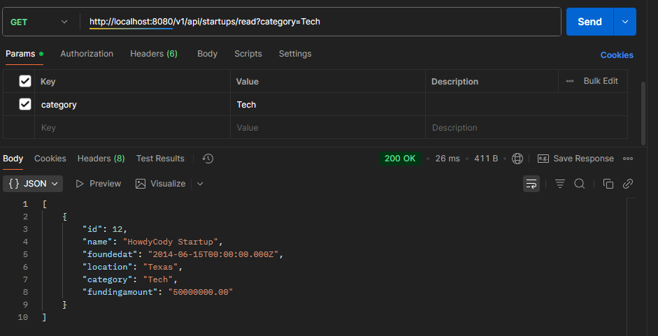
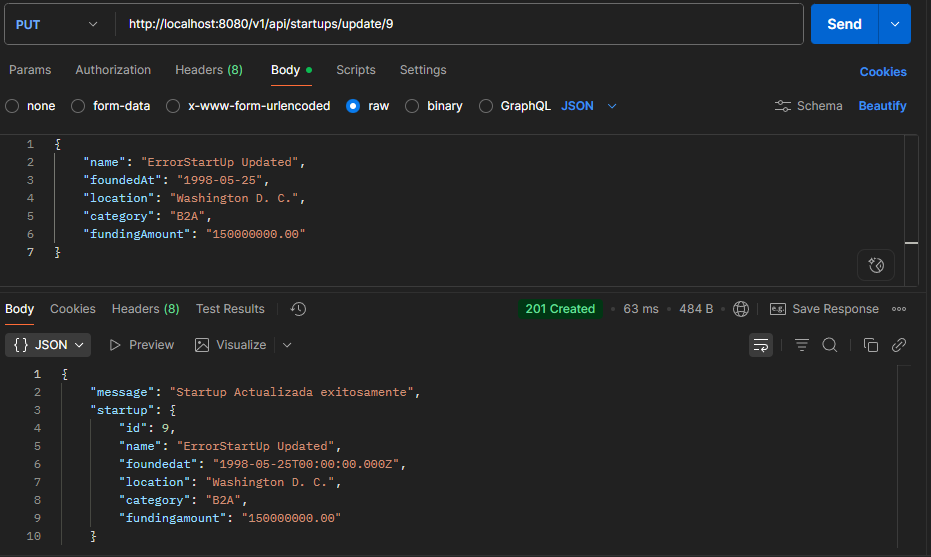
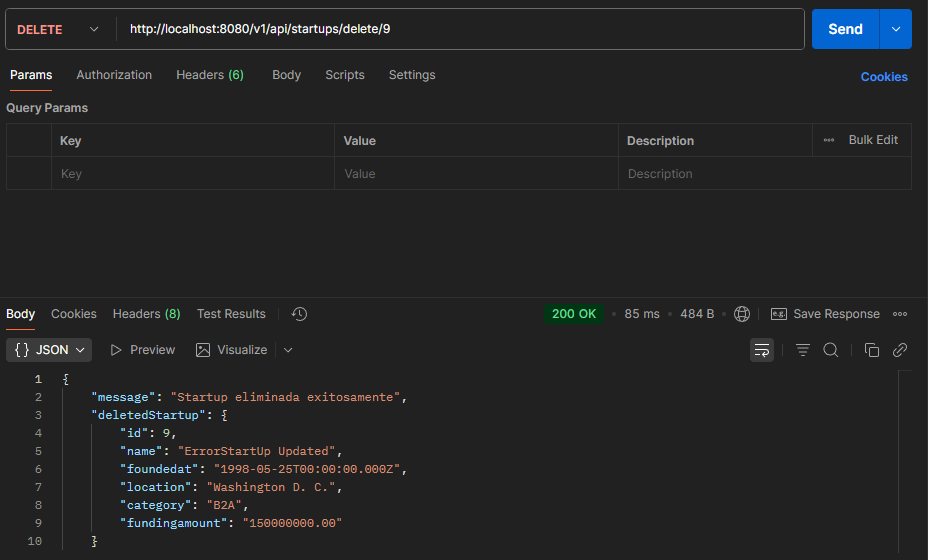
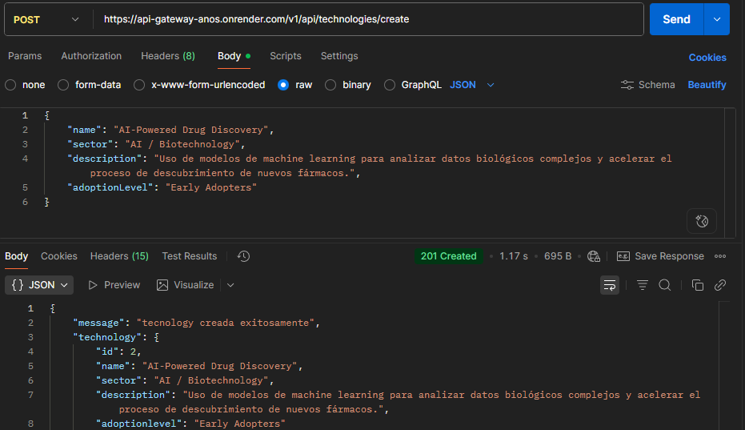
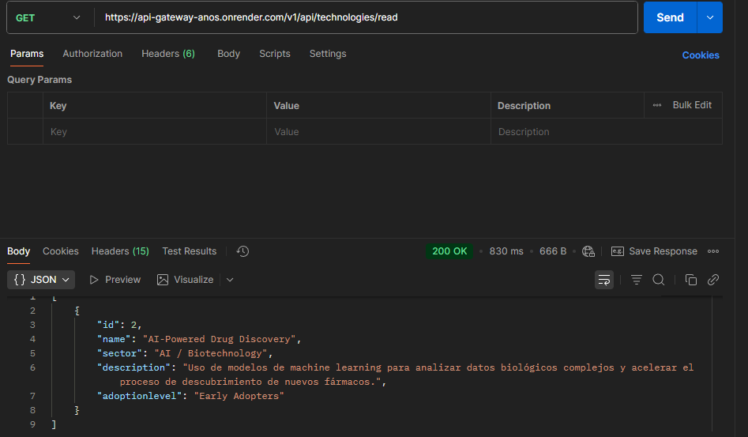
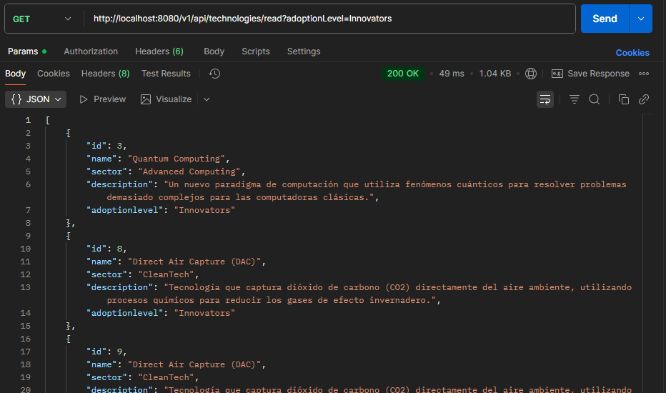
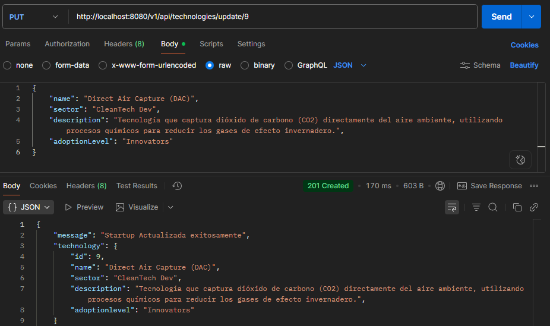
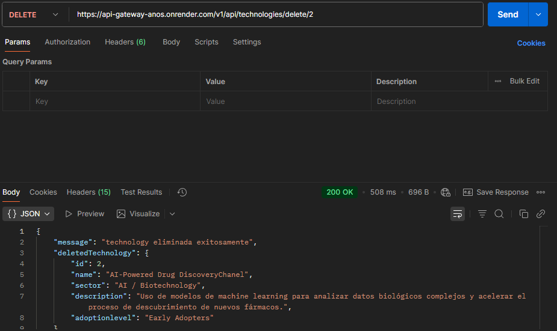

# Reto de Desarrollo CIID - [Luis Gerardo Nava Arzate ]

## 1. Descripción del Proyecto

Este proyecto es una implementación de una arquitectura de microservicios para gestionar Startups y Tecnologías Emergentes. El sistema está completamente contenerizado con Docker y expuesto a través de un API Gateway (Nginx). El front-end es una Single Page Application construida con React que consume la API.

## 2. Diagrama de Arquitectura

    [  Usuario (Navegador React)  ]
                |
                v
    [  API Gateway (Nginx :8080)  ]
                |
    +--------+------------------+
    |                           |
    v                           v
    [ 8 Microservicios ]      [ Base de Datos ]
     (Node.js / Express)         (PostgreSQL)

## 3. Requisitos Previos

* Docker y Docker Compose
* Node.js (v18 o superior)
* Un cliente de API como Postman para pruebas.

## 4. Configuración del Entorno

1.  Clonar el repositorio.
2.  Renombrar el archivo `.env.example` a `.env`.
3.  Revisar las variables en `.env`.

## 5. Cómo Correr Localmente

Para levantar todo el sistema, ejecuta el siguiente comando en la raíz del proyecto:

```bash
docker-compose up --build
```

El Front-End estará disponible en http://localhost:5173.

El API Gateway (para probar con Postman) estará en http://localhost:8080.

## 6. Rutas de la API
    Startups: /startups
        * **`POST /v1/api/startups/create`**: Crea una nueva startup.
    * **Body:**
        ```json
        {
            "name": "Mi Nueva Startup",
            "foundedAt": "2025-10-02",
            "location": "Online",
            "category": "AI",
            "fundingAmount": 10000
        }
        ```

* **`GET /v1/api/startups/read`**: Obtiene una lista de startups. Acepta filtros.
    * **Ejemplo con filtro:** `GET /v1/api/startups/read?category=AI`

* **`GET /v1/api/startups/read/:id`**: Obtiene una startup por su ID.

* **`PUT /v1/api/startups/update/:id`**: Actualiza una startup existente.

* **`DELETE /v1/api/startups/delete/:id`**: Elimina una startup.
    Technologies: /technologies
        * **`POST /v1/api/technologies/create`**: Crea una nueva tecnología.
    * **Body:**
        ```json
        {
            "name": "Direct Air Capture (DAC)",
            "sector": "CleanTech Dev",
            "description": "Tecnología que captura dióxido de carbono (CO2) directamente del aire ambiente, utilizando procesos químicos para reducir los gases de efecto invernadero.",
            "adoptionLevel": "Innovators"
        }
        ```

* **`GET /v1/api/technologies/read`**: Obtiene una lista de tecnologías. Acepta filtros.
    * **Ejemplo con filtro:** `GET /v1/api/technologies/read?adoptionLevel=Innovators`

* **`GET /v1/api/technologies/read/:id`**: Obtiene una startup por su ID.

* **`PUT /v1/api/technologies/update/:id`**: Actualiza una startup existente.

* **`DELETE /v1/api/technologies/delete/:id`**: Elimina una startup.
## 7. Pruebas Manuales
### Crear una Startup
Se realiza una petición `POST` a `/v1/api/startups/create` con un cuerpo JSON válido. Se espera una respuesta `201 Created` con los datos de la nueva startup

### Leer Startups
Se realiza una petición `GET` a `/v1/api/startups/read`. Se espera una respuesta `200 OK` con una lista de todas las startups.

### Leer Startups con Filtros
Se realiza una petición `GET` a `/v1/api/startups/read?category=AI`. Se espera una respuesta `200 OK` con una lista de startups que coincidan con el filtro especificado.

### Actualizamos una startup
Se realiza una petición `PUT` a `/v1/api/startups/update/:id` con un cuerpo JSON válido para actualizar una startup existente. Se espera una respuesta `200 OK` con los datos de la startup actualizada.

### Eliminamos una startup
Se realiza una petición `DELETE` a `/v1/api/startups/delete/:id` para eliminar una startup existente. Se espera una respuesta `200 OK` con un mensaje de éxito.

### Creamos una tecnología
Se realiza una petición `POST` a `/v1/api/technologies/create` con un cuerpo JSON válido para crear una nueva tecnología. Se espera una respuesta `201 Created` con los datos de la nueva tecnología.

### Leemos las tecnologías
Se realiza una petición `GET` a `/v1/api/technologies/read` para obtener una lista de todas las tecnologías. Se espera una respuesta `200 OK` con una lista de todas las tecnologías.

### Leemos las tecnologias por filtro
Se realiza una petición `GET` a `/v1/api/technologies/read?adoptionLevel=Innovators` para obtener una lista de tecnologías que coincidan con el filtro especificado. Se espera una respuesta `200 OK` con una lista de tecnologías que coincidan con el filtro.

### Actualizamos una tecnología
Se realiza una petición `PUT` a `/v1/api/technologies/update/:id` con un cuerpo JSON válido para actualizar una tecnología existente. Se espera una respuesta `200 OK` con los datos de la tecnología actualizada.

### Eliminamos una tecnología
Se realiza una petición `DELETE` a `/v1/api/technologies/delete/:id` para eliminar una tecnología existente. Se espera una respuesta `200 OK` con un mensaje de éxito.


## 8. Capturas de Pantalla

### Escritorio (Desktop)


### Tablet


### Móvil (Smartphone)


### 9. Limitaciones y Siguientes Pasos
### Limitaciones Actuales:

Autenticación y Autorización: El sistema no cuenta con un mecanismo de seguridad para proteger las rutas. Todas son públicas.

Migraciones de DB: No hay un servicio de migraciones automáticas. La estructura de la base de datos se debe aplicar manualmente (o mediante un script seed.sql si se incluyó).

Pruebas Automatizadas: El proyecto carece de pruebas unitarias o de integración, dependiendo únicamente de las pruebas manuales.

### Posibles Mejoras (Siguientes Pasos):

Implementar JWT: Agregar autenticación basada en JSON Web Tokens para proteger los endpoints.

Métricas y Monitoreo: Integrar un sistema como Prometheus o Grafana para monitorear la salud y el rendimiento de los servicios.

CI/CD: Crear un pipeline de Integración y Despliegue Continuo para automatizar las pruebas y los despliegues.

Comunicación Asíncrona: Para operaciones más complejas, se podría implementar un bus de eventos (como RabbitMQ o Kafka) en lugar de comunicación HTTP directa.